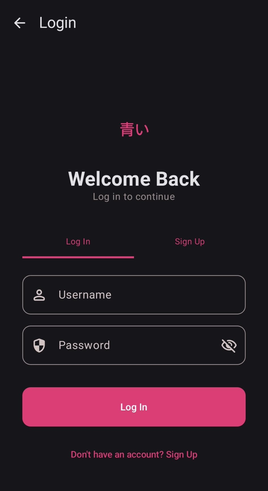
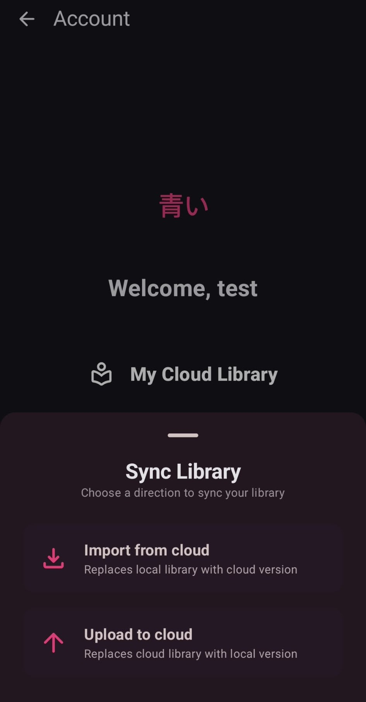

<div align="center">


# Aoi

A modern manga & manhwa reader for Android — clean, fast, and built around an extension-based source system.

[](https://github.com/cardal013/aoi)
[](https://kotlinlang.org)
[](LICENSE)
[](#project-status)
[](https://github.com/cardal013/aoi/releases/latest)
[](https://github.com/cardal013/aoi/releases/latest)

[**Website**](https://aoi-mangas.vercel.app/) **•** [**Download**](https://github.com/cardal013/aoi/releases/latest)

</div>

---

## Screenshots

<p align="center">
  <table>
    <tr>
      <td></td>
      <td></td>
      <td></td>
    </tr>
  </table>
</p>

## What is Aoi

Aoi is built on top of [Mihon](https://github.com/mihonapp/mihon), adding a dedicated backend and database layer on top of it. Instead of keeping everything only on-device, Aoi adds user accounts (username, profile, and related data) and a proper per-manga reading-status system, so your library isn't just a flat list — it's organized the way you actually read.

## Features

||Feature|Description|
|-|-|-|
|👤|**User accounts**|Sign in and keep your library and reading status tied to your profile instead of just the device.|
|🗂️|**Reading status categories**|Save each manga as Reading, Completed, Dropped, or Plan to Read.|
|📖|**Clean, focused reader**|Inherited from Mihon.|
|☁️|**Cloud-backed library**|Backed by a database — access your library from the website too.|
|🔄|**Automatic sync**|Your library, reading status and progress sync on their own: changes go up a few seconds after you make them and the app pulls what changed in the cloud when it opens. A *Full resync* (under *Advanced*) re-sends everything if something gets out of sync.|
|📌|**Plan to Read by default**|New manga added to your library start in *Plan to Read*.|

### Reading status categories

|Status|Meaning|
|-|-|
|📖 Reading|Currently in progress|
|✅ Completed|Finished reading|
|❌ Dropped|Stopped, not continuing|
|📌 Plan to Read|Saved for later|

### How the sync works

- Opening the app (or logging in) pulls what changed in the cloud since the last sync, then sends what changed on the device.
- Every local change (library entries, reading status, chapter read/page) is marked on the device and sent about 5 seconds later, in batches. Reading progress is also sent live while you read.
- The sync remembers the time of its last success; if something fails, the next sync sends it again.
- The first sync of an account on a device merges both libraries: nothing is deleted and read progress never goes backwards.
- If manga in your library are no longer in the cloud (removed on another device), the app asks before removing them here.
- *Full resync* replaces the cloud library with the one on the device, after a confirmation.


## Installation

Download the latest APK from the [Releases page](https://github.com/cardal013/aoi/releases/latest) (or straight from the [website](https://aoi-mangas.vercel.app/)) and install it on your Android device.

<!-- TODO: add a Play Store badge here if/when Aoi is published -->

## Building from source

1. JDK 21 and the Android SDK (Android Studio's bundled JDK works).
2. Create `ignorance/local.properties` (git-ignored) with your Supabase project:
   ```properties
   SUPABASE_URL=https://<project>.supabase.co
   SUPABASE_ANON_KEY=<anon key>
   ```
   Without it the app builds but cannot connect to the cloud.
3. Run the SQL in [`supabase/migrations`](supabase/migrations) on your Supabase project, in order (incremental import and row level security). [`supabase/rls_check.sql`](supabase/rls_check.sql) shows the current tables, policies and grants without changing anything.
4. Build:
   ```powershell
   .\gradlew.bat :app:assembleDebug     # app/build/outputs/apk/debug/app-universal-debug.apk
   .\gradlew.bat assembleRelease        # needs keystore.properties + the keystore
   ```
   The debug build installs next to the release one (`com.cardal.aoi.dev`).

## Changelog

### Unreleased
- Automatic sync: no more *Upload*/*Import* buttons, the account screen shows when it last synced
- The first sync on a device merges both libraries instead of overwriting one with the other
- Manga missing from the cloud are no longer removed from the device without asking
- Manga deleted from the local database (e.g. *Clear database*) are also removed from the cloud
- Account screen translated (English and Portuguese), reading status names in Portuguese
- No more username or internal email in the logs; the website warns that passwords can't be recovered

### 0.20.5
- Incremental sync with the cloud (only what changed), with a *Full resync* button
- *Import from cloud* only pulls what changed, paginated
- New manga go to *Plan to Read* by default
- Local database migration (dirty tracking for the sync) and a Supabase migration (`user_library.updated_at`)

### 0.20.4
- Import no longer removes local chapters when a source fails
- Import reads progress in pages of 1000 rows

## Built with


## Project status


## Baseado no Mihon

O Aoi é um fork do [Mihon](https://github.com/mihonapp/mihon), distribuído sob a licença [Apache 2.0](LICENSE) (a mesma do Mihon). O leitor, as extensões e as fontes vêm do Mihon; o Aoi acrescenta contas, estados de leitura e a biblioteca na cloud. Obrigado à equipa do Mihon e aos seus contribuidores.

## Disclaimer

Aoi is a reader, not a content host. It does not distribute or store any manga or manhwa itself; all content is retrieved at request time from the sources you choose to enable.

---

<p align="center">
  <a href="https://aoi-mangas.vercel.app/">Website</a> •
  <a href="LICENSE">License</a>
</p>

